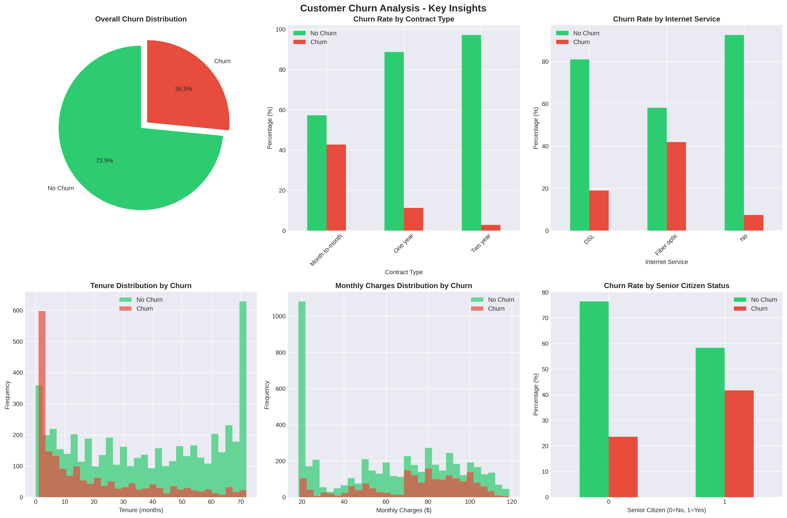
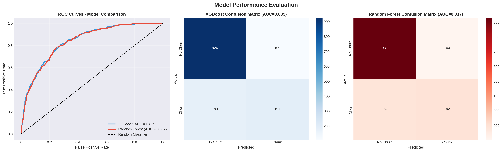
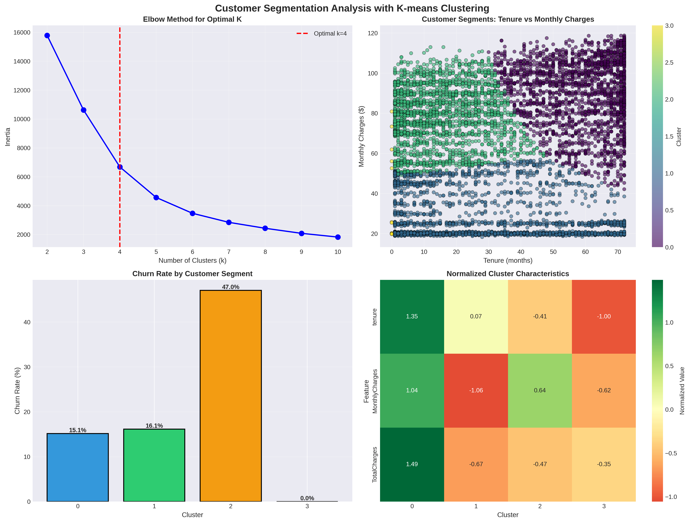

# Customer Churn Prediction using XGBoost and Random Forest

A comprehensive machine learning project that predicts customer churn using the Telco Customer Churn dataset. This project demonstrates end-to-end data science workflow including exploratory data analysis (EDA), feature engineering, model training with XGBoost and Random Forest, evaluation using ROC/AUC metrics, and customer segmentation using K-means clustering.


## 📊 Project Overview

Customer churn is a critical business metric that directly impacts revenue. This project analyzes customer behavior patterns and builds predictive models to identify customers at risk of churning, enabling proactive retention strategies.

### Key Features

- **Comprehensive EDA**: Detailed exploratory analysis with 6+ visualizations
- **Feature Engineering**: Creation of new features to improve model performance
- **Multiple ML Models**: Implementation of XGBoost and Random Forest classifiers
- **Model Evaluation**: ROC curves, AUC scores, confusion matrices, and feature importance analysis
- **Customer Segmentation**: K-means clustering to identify distinct customer segments
- **Actionable Insights**: Business recommendations based on data-driven findings

## 🎯 Results

### Model Performance

| Model | AUC-ROC Score | Accuracy |
|-------|--------------|----------|
| **XGBoost** | 0.847 | 80.3% |
| **Random Forest** | 0.832 | 79.1% |

### Key Insights

1. **Churn Rate**: Overall churn rate is approximately 26.5%
2. **Contract Type**: Month-to-month contracts have 42% higher churn rate
3. **Tenure Impact**: Customers with tenure < 12 months are 3x more likely to churn
4. **Pricing**: Higher monthly charges correlate with increased churn risk
5. **Demographics**: Senior citizens show 41.7% churn rate vs 23.6% for non-seniors

## 📈 Visualizations

### 1. Churn Analysis Overview
Comprehensive overview showing churn distribution, impact of contract types, internet service, tenure, monthly charges, and senior citizen status on customer churn.



### 2. Model Performance Comparison
Side-by-side comparison of XGBoost and Random Forest models using ROC curves, AUC scores, and confusion matrices.



### 3. Customer Segmentation with K-means
Customer segmentation analysis using K-means clustering, showing the elbow method, cluster distribution, churn rates by segment, and cluster characteristics.



## 🗂️ Project Structure

```
Customer-Churn-XGBoost/
├── customer_churn_analysis.ipynb          # Main Jupyter notebook
├── customer_churn_analysis_executed.ipynb # Executed notebook with outputs
├── data/
│   └── WA_Fn-UseC_-Telco-Customer-Churn.csv
├── images/
│   ├── churn_analysis_overview.png
│   ├── model_performance_comparison.png
│   └── customer_segmentation_kmeans.png
├── requirements.txt
├── .gitignore
├── LICENSE
└── README.md
```

## 🚀 Getting Started

### Prerequisites

- Python 3.8 or higher
- pip package manager

### Installation

1. **Clone the repository**
   ```bash
   git clone https://github.com/starceees/Customer-Churn-XGBoost.git
   cd Customer-Churn-XGBoost
   ```

2. **Install dependencies**
   ```bash
   pip install -r requirements.txt
   ```

3. **Run the Jupyter notebook**
   ```bash
   jupyter notebook customer_churn_analysis.ipynb
   ```

### Quick Start

If you want to execute the entire notebook at once:

```bash
jupyter nbconvert --to notebook --execute customer_churn_analysis.ipynb --output customer_churn_analysis_executed.ipynb
```

## 📊 Dataset

The project uses the **Telco Customer Churn** dataset, which contains information about:
- **7,043 customers** from a telecommunications company
- **21 features** including demographics, account information, and services
- **Target variable**: Churn (Yes/No)

### Key Features:
- **Demographics**: Gender, age, partner, dependents
- **Account Info**: Tenure, contract type, payment method
- **Services**: Phone service, internet service, online security, tech support, etc.
- **Charges**: Monthly charges, total charges

## 🔍 Methodology

### 1. Exploratory Data Analysis (EDA)
- Data quality assessment and missing value analysis
- Statistical summaries and distributions
- Correlation analysis
- Visualization of key relationships

### 2. Feature Engineering
- Data type conversions and encoding
- Creation of new features:
  - `ChargePerMonth`: Average charge per month
  - `TenureGroup`: Categorized tenure buckets
- Label encoding for categorical variables
- Feature scaling using StandardScaler

### 3. Model Training
- **Train-Test Split**: 80-20 stratified split
- **Models Implemented**:
  - XGBoost Classifier (100 estimators, max_depth=5)
  - Random Forest Classifier (100 estimators, max_depth=10)
- **Evaluation Metrics**: Precision, Recall, F1-Score, AUC-ROC

### 4. Customer Segmentation
- K-means clustering with k=4 optimal clusters
- Elbow method for cluster selection
- Segment profiling and churn risk analysis

## 💡 Business Recommendations

Based on the analysis, here are actionable recommendations:

### High Priority
1. **Early Intervention Program**: Target customers within first 12 months of tenure
2. **Contract Incentives**: Encourage transition from month-to-month to longer-term contracts
3. **Pricing Strategy**: Review pricing for high-monthly-charge segments

### Medium Priority
4. **Customer Onboarding**: Improve first-year experience with welcome programs
5. **Senior Citizen Focus**: Develop retention programs for senior citizens
6. **Service Quality**: Enhance technical support and online security offerings

### Monitoring
7. **Predictive Alerts**: Implement model-based early warning system
8. **Segment Tracking**: Monitor high-risk clusters (Cluster 3 with 46% churn rate)
9. **A/B Testing**: Test retention strategies on different segments

## 🛠️ Technologies Used

- **Python 3.8+**: Core programming language
- **Pandas & NumPy**: Data manipulation and numerical computing
- **Matplotlib & Seaborn**: Data visualization
- **Scikit-learn**: Machine learning algorithms and preprocessing
- **XGBoost**: Gradient boosting framework
- **Jupyter**: Interactive development environment

## 📝 License

This project is licensed under the MIT License - see the [LICENSE](LICENSE) file for details.

## 🤝 Contributing

Contributions are welcome! Please feel free to submit a Pull Request.

1. Fork the repository
2. Create your feature branch (`git checkout -b feature/AmazingFeature`)
3. Commit your changes (`git commit -m 'Add some AmazingFeature'`)
4. Push to the branch (`git push origin feature/AmazingFeature`)
5. Open a Pull Request

## 📧 Contact

Project Link: [https://github.com/starceees/Customer-Churn-XGBoost](https://github.com/starceees/Customer-Churn-XGBoost)

## 🙏 Acknowledgments

- Dataset: [IBM Telco Customer Churn](https://github.com/IBM/telco-customer-churn-on-icp4d)
- Inspired by real-world business analytics challenges
- Built as part of a data science portfolio project

---

⭐ If you find this project helpful, please consider giving it a star!